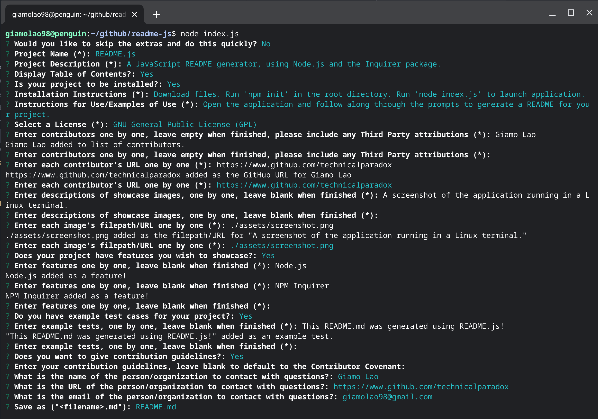

# README.js
##### A JavaScript README.md generator using Node.js and Inquirer.
### License

*Click link for license details.*

---------------
## Table of Contents
* [Installation](#installation)
* [Usage](#usage)
* [Credits](#credits)
* [Features](#features)
* [Contribution Guidelines](#contribution-guidelines)
* [Tests](#tests)
* [Questions](#questions)
---------------
## Installation
1. Download source files as .zip or download from releases.
2. Unzip the files into the root directory.
3. Run 'npm install' in root directory.
4. Run 'node index.js' in root directory to launch application.
## Usage
Launch the application and follow the prompts to generate your project's README!

## Credits
[Giamo Lao](https://www.github.com/technicalparadox)
## Features
* Node.js
* Inquirer
## Contribution Guidelines
[The Contributor Covenant](https://www.contributor-covenant.org/)
## Tests
* This README was generated using README.js!
## Questions
Any questions should be directed to

[Giamo Lao](https://www.github.com/TechnicalParadox)

[giamolao98@gmail.com](mailto:https://www.github.com/TechnicalParadox)
